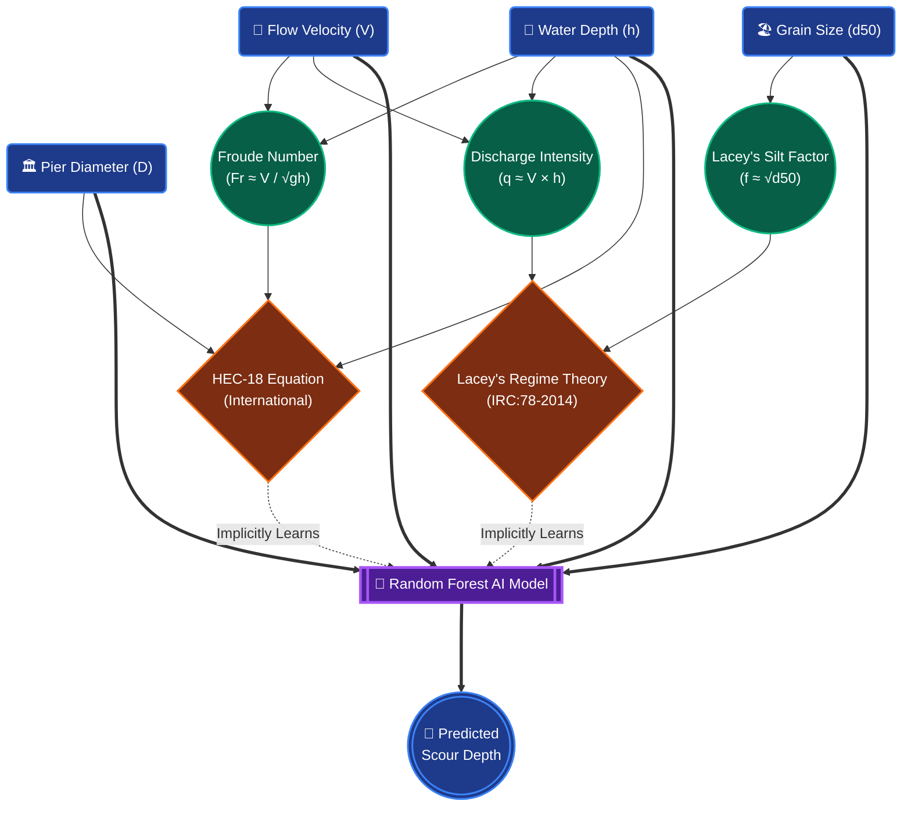

# Parameter Logic Diagram

You can use or recreate this diagram in your presentation slides to visually explain to your professor how the 4 parameters are mathematically sufficient. 

This flowchart shows how the raw inputs map perfectly to the two major empirical theories (HEC-18 and Lacey's), proving that our AI has the complete mathematical blueprint to predict scour depth.

### How to explain this graphic:
1. Point to the **blue Input boxes** at the top. State that these are the only 4 parameters your model needs.
2. Point out how **Velocity (V)** and **Depth (h)** combine in fluid dynamics to form the Froude Number and Discharge Intensity.
3. Show how **Grain Size (d50)** entirely dictates the bed erodibility (Silt factor).
4. Explain that because the AI (purple block) receives all 4 raw inputs, it mathematically has the full capability to implicitly learn both the **HEC-18 standard** and **Lacey's Indian standard**.
