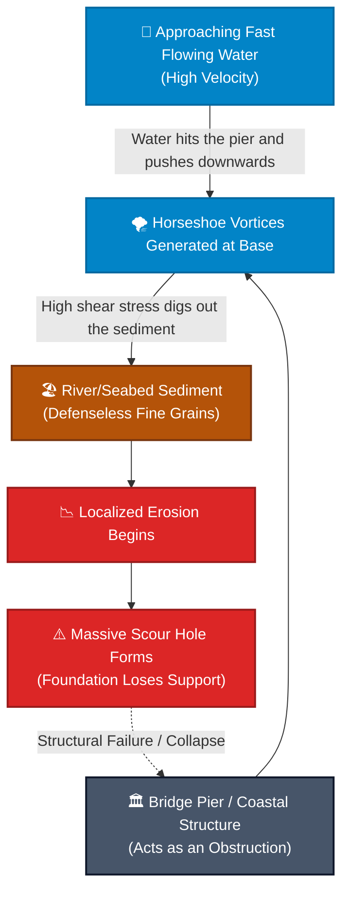

# Problem Statement: What is Pier Scour?

Use this diagram to visually explain the physical problem to your audience before jumping into the Machine Learning part.

### 1. Physical Schematic (Side View of a River/Ocean Bed)

```text
       Flow Velocity (V)
   ~~~~~~~~~~~~~~~~~~~~~~~~~~~~~~~~~~~~~~~~~~~~~~~~~~~~~ Water Surface
    -->      -->      -->   |   |   
                            |   |   <-- Bridge Pier (Diameter D)
    -->      -->            |   |   
              Horseshoe     |   |   
               Vortex  (⟳)  |   |   (⟲) Wake Vortex
   ===================  ___ |   | ___  ================= Original River Bed (Grain Size d50)
                      /     |   |     \
    Eroded Sand ---> /      |   |      \
                    /       |___|       \
                   |                     |
                    \___ Scour Hole ____/ 
                     (Depth we predict)

======================================================== Hard Bedrock
```

### 2. The Process Mechanism
This flowchart breaks down exactly how the physical environment creates the problem that threatens the infrastructure.



### How to use this on your slide:
- **The Problem:** Explain that when flowing water hits a solid obstruction, it gets pushed downward, digging a massive hole (scour) around the base. Explain that if the scour hole gets deep enough, the bridge collapses.
- **Why we need AI:** Traditionally, guessing how deep the hole will get requires solving complex vortex equations. But by throwing the **Water Flow, Pier Size, and Sand type** into our trained Random Forest, we can instantly predict the exact depth of the danger zone!
